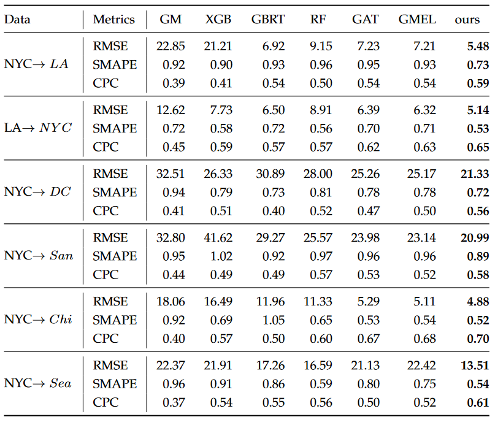
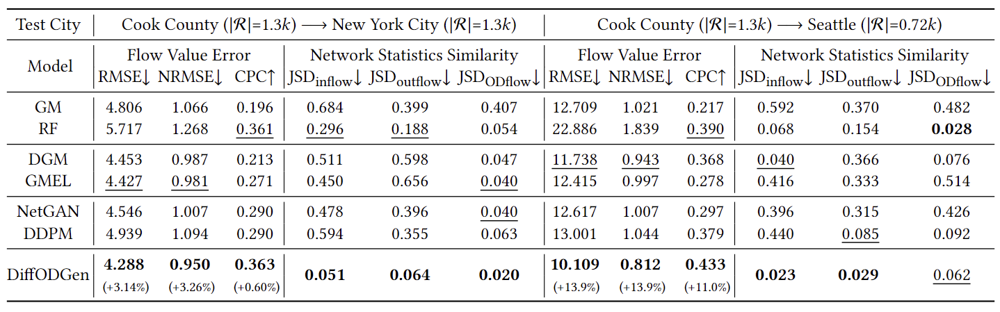

# ODConstruction

**Definition of OD Matrix.** The OD flows are organized in the form of an OD matrix $\bf F$ shown below,

$$
\mathbf{F} = 
\begin{bmatrix} 
    f_{11} & f_{12} & ...    & f_{1N} \\ 
    f_{21} & f_{22} & ...    & f_{2N} \\
    \vdots & \vdots & \ddots & \vdots \\
    f_{N1} & f_{N2} & ...    & f_{NN}
\end{bmatrix},
$$

in which each element represents the flow $f_{ij}$ between a specific pair of regions. An OD matrix generally represents the mobility flow between all regions within an entire city.

**Problem Definition.** The OD construction problem aims to construct the complete OD matrix $\mathbf{F}$ for the city based on easily accessible information without any OD flow information available.

## Requirements

- python 3.8
- tqdm == 4.64.0
- pytorch == 2.0.0
- dgl == 0.8
- pandas == 1.4.4
- geopandas == 0.12.2
- matplotlib == 3.5.3
- mlflow == 2.3.2
- networkx == 2.8.6
- pyproj == 3.4.1
- scikit-learn == 1.1.2
- scipy == 1.9.1
- tensorboard == 2.12.3

## Systematic Summary

coming soon.

## Performance Comparison

**Topology known**

**Topology unknown**

## More conductive experiments are coming soon.